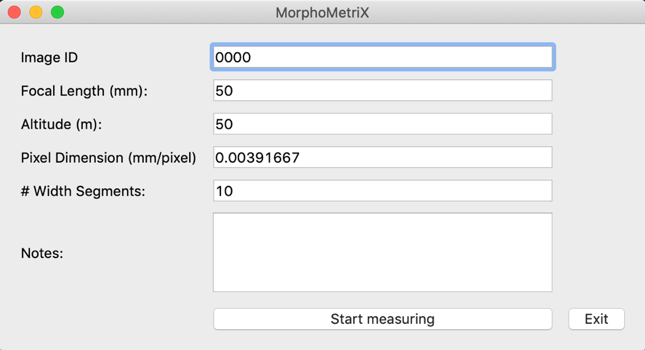
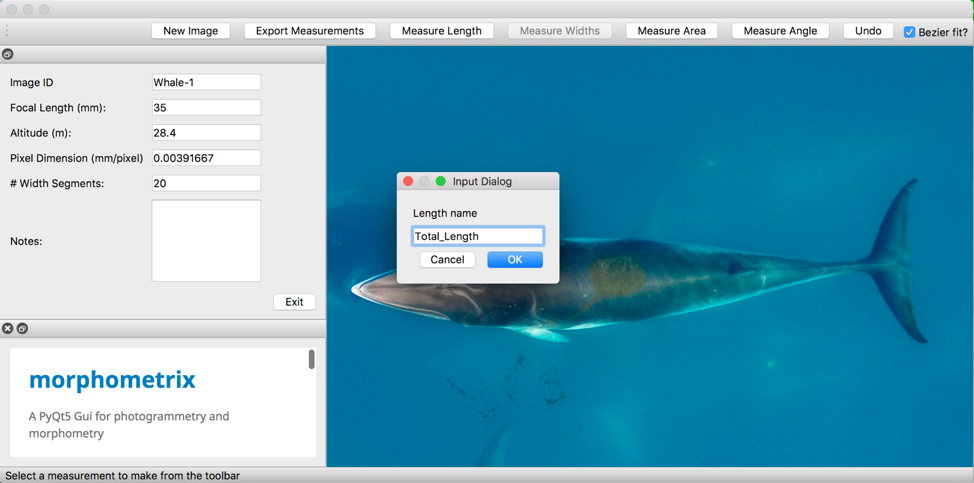
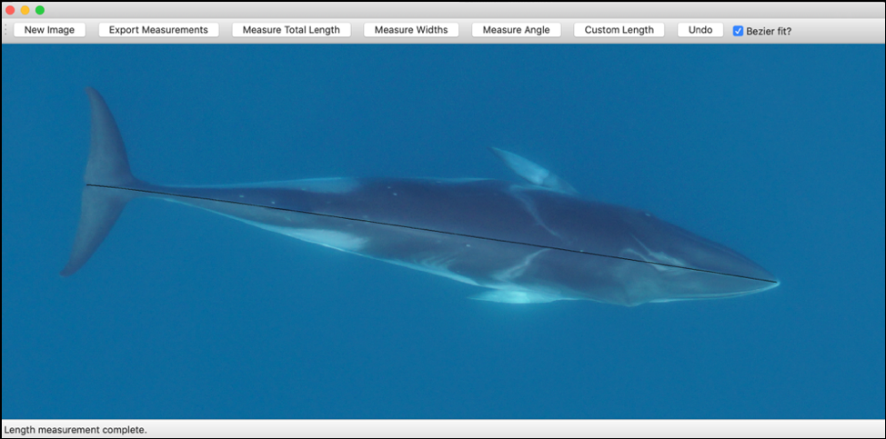
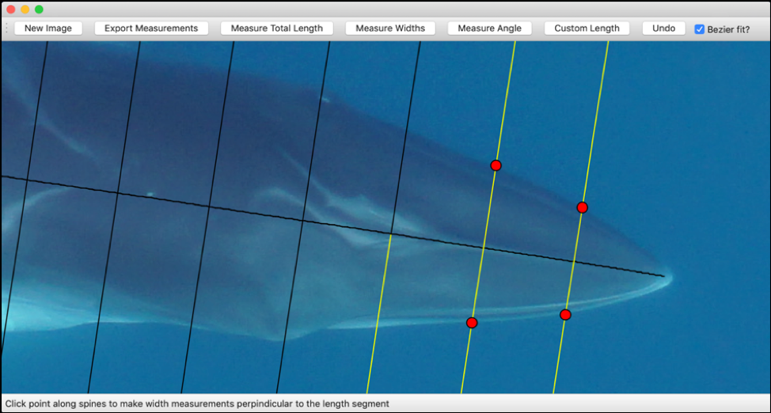
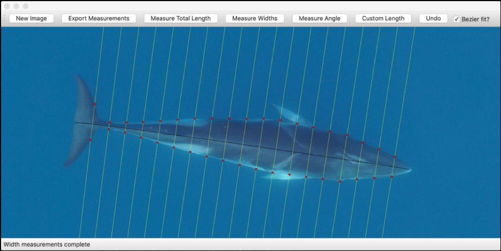

# MorphoMetriX

## Installation 

The easiest way to get `MorphoMetriX` is to install it into the [Anaconda](https://www.anaconda.com/distribution/) Python distribution. In Anaconda create and/or activate your preferred environment and in terminal enter

    conda install -c wingtorres morphometrix

## Running MorphoMetriX
After activating and installing into your environment of choice, open the GUI with the command
    
    python -m morphometrix

In the input frame on the left, enter image details, camera specifications, altitude, number of width segments desired, and any notes (see Figure 1-3 in our JOSS article for examples).

 Select “New Image” to import an image (.jpg) for photogrammetric analysis.

__*Measuring*__

Once an image has been imported, you can begin making measurements by selecting “Measure Length”, “Measure Area” or “Measure Angle”. The user can label each measurement with a unique name (i.e. “Total Length”). Widths can be measured by selecting “Measure Widths” following any length measurement. The number of width segments desired can be specified in “# Width Segments” in the input frame. Examples below.

*Quick tips*

-	**Zoom in/out** - Scroll
-	**Pan** - <kbd>⇧ Shift</kbd> + scroll
-	**Place a point** - Single click
-	**Complete a length measurement** - Double click
-	**Replace last point** - Select “Undo” 

__*Measure Length*__ (–)

Select “Measure Length”. A box will appear for the user to create a unique measurement name, i.e. “Total Length”, “Fluke Span”, etc. Decide if you want a “Bezier fit?” applied to the length measurement. This is especially useful if the animal is curved, as it will apply a smooth fitting curve to the points selected in the measurement. Make single clicks to make a measurement and double click to finish. 

__*Measuring Widths*__ 

After a length measurement is complete, widths segments perpendicular to the length measurement can be applied by selecting “Measure Widths”. The picture below has 20 width segments, or in 5% increments of total length. Each successive width is highlighted to guide the selection of points along the width segment.

Zoom in and select a point along the highlighted width line, which in this case is the edge of the whale. A red dot will mark the point selected and the next width segment will be highlighted. If the user accidentally selects a point adjacent to the highlighted line, the red dot will snap to the closest point on the highlighted line and record that point.

Once a point has been selected on each highlighted width line, the width measurements are complete.

__*Measure Area*__ 

To create a custom area measurement, select “Measure Area”. A box will appear for the user to create a unique label, i.e. “Fluke Area” or “Diatom Patch”. Once a label is created, click points to draw a polygon around the desired area. A blue dot will denote the final connecting point of the polygon and the area measured will be shaded. 

__*Measure Angle*__ 

To create a custom angle measurement, select “Measure Angle”. A box will appear for the user to create a unique label, i.e. “Sweep Angle” or “Fluke-Leading Edge”. Draw the first vector, click to create a vertex, then draw the second vector. The angle will be calculated between the two vectors.

__*Additional measurements*__

To make other measurement on the same image, such as “Fluke Span”, “Rostrum-Blowhole”, etc., simply select one of the options (Measure Length/Area/Angle) and follow the relevant steps previously mentioned. Repeat to your heart's content.

__*Exporting Measurements*__

Once measurements are complete, select “Export Measurements” and select a folder to save a [.csv](<https://github.com/wingtorres/morphometrix/blob/master/demo/test-image.csv>) containing all the measurements (in meters) and their labels and a [.png](<https://github.com/wingtorres/morphometrix/blob/master/demo/test-image-measurements.png>) image of the measurement lines drawn on the image.

*Open Next Image*

To measure a new animal/image select “New Image”, enter updated parameters in the left input window (if any), and begin measuring.

## Demo

For a demonstration of ``MorphoMetriX`` used to measure a Minke whale, please refer to the [demo]( <https://github.com/wingtorres/morphometrix/blob/master/demo>) directory. 

# Attribution

If you make use of this code, you should cite the following paper:

Torres et al., (2019). MorphoMetriX: a photogrammetric measurement GUI for morphometric analysis of megafauna.. Journal of Open Source Software, 4(44), 1825. https://doi.org/10.21105/joss.01825

# Contributing 

We would love for you to contribute to MorphoMetriX! Please read our [contributing guidelines](CONTRIBUTING.md).

# Code of Conduct

See [CODE_OF_CONDUCT](CODE_OF_CONDUCT.md)

# License

Copyright (C) 2018-2019 Walter Torres, KC Bierlich

``MorphoMetriX`` is free software made available under the MIT License. For details see the the [LICENSE]( <https://github.com/wingtorres/morphometrix/blob/master/LICENSE>) file.

# Contributors

Walter I. Torres and KC Bierlich are the developers of this software.

