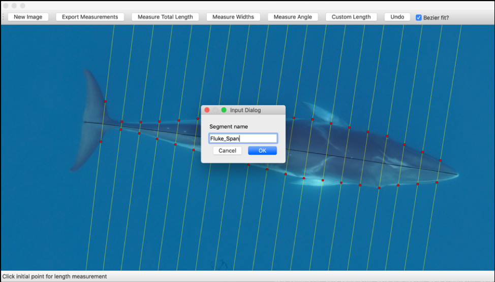
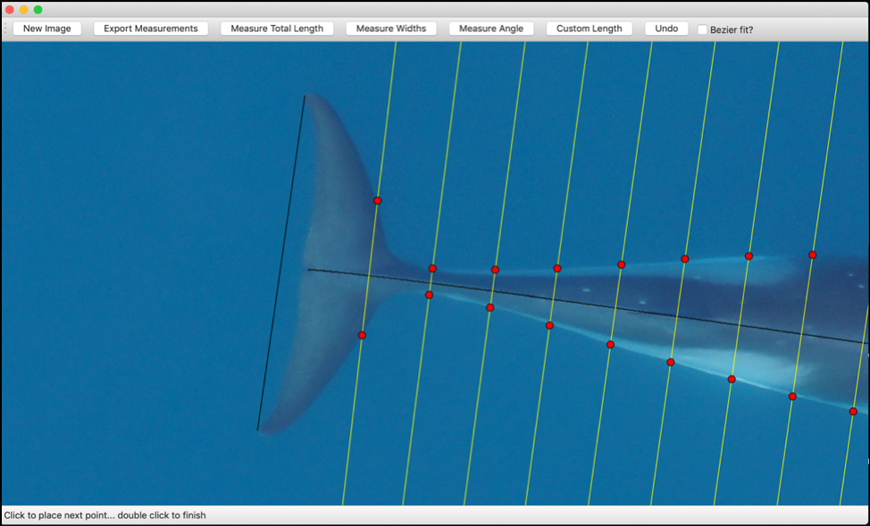

# MorphoMetriX

## Installation 

The easiest way to get `MorphoMetriX` is to install it into the [Anaconda](https://www.anaconda.com/distribution/) Python distribution. Once Anaconda has been installed, create and/or activate your preferred environment and in terminal enter

    conda install -c wingtorres morphometrix

## Using MorphoMetriX
After activating and installing into your environment of choice, open the GUI window with the command
    
    python -m morphometrix

opening the dialog box below. Enter image details, camera specifications, altitude, number of width segments desired, and any notes (see Figure 1-3 in our [JOSS article](???) for examples). 

When ready, select “Start measuring”. A box appears as below. Select “New Image” to import an image (.jpg) for photogrammetric analysis. 

*Make Measurements*

Once an image has been imported, you can begin making measurements by selecting “Measure Total Length”, “Custom Length” or “Measure Angle”. Widths can be measured by selecting “Measure Widths” following a total length or custom length measure. The number of width segments desired can be specified in “# Width Segments” in the dialog box. Examples below.

*Quick tips*

-	Select “Undo” to re-select a point
-	Scroll to zoom in/out
-	Shift + scroll to pan
-	Single click to place a point
-	Double click to complete a length measurement 

*Total length*

Select “Measure Total Length”. Decide if you want a “Bezier fit?” applied to the length measurement. This is especially useful if the animal is curved, as it will apply a Bezier curve fit to the points selected in the measurement, where the first and last points are fixed. Make single clicks and drag to add line segments and double click to finish the measurement. 

*Measuring Widths*

After a total length or custom length measurement is complete, widths segments perpendicular to the length measurement can be applied by selecting “Measure Widths”. The picture below has 20 width segments, or in 5% increments of total length. Each width is highlighted to guide the user to select points along the width segment. *Note that “Bezier fit?” must be checked while measuring widths.

Zoom in and select a point along the highlighted width line, which in this case is the edge of the whale. A red dot will mark the point selected and the next width segment will be highlighted. If the user accidentally selects a point adjacent to the highlighted line, the red dot will snap to the closest point on the highlighted line and record that point. 

Once a point has been selected on each highlighted width line, the width measurements are complete.

*Measuring custom lengths and angles*

To make a custom length or angle measurement select “Custom Length” or “Measure Angle”, respectively. A box will appear for the user to create a unique measurement name, i.e. “Fluke Span” or “Sweep Angle”. 

After a unique name is assigned to the custom length or angle, you are ready to make the measurement. If measuring a length, decide if you want the Bezier curve applied. Click points to make the measurement and double click when finished. Repeat if more custom length/angle measurements are desired.

*Exporting Measurements*

Once measurements are complete, select “Export Measurements” and select a folder to save a [.csv](<https://github.com/wingtorres/morphometrix/blob/master/demo/test-image.csv>) containing all the measurements (in meters) and their labels and a .png image of the measurement lines drawn on the image.

*Open Next Image*

To measure a new animal/image, close the measurement box, enter the new parameters in the dialog box (if any), and then select “Start measuring”. Then select “New Image” to import the next image for measurement.

## Demo

For a demonstration of ``MorphoMetriX`` used to measure a Minke whale, please refer to the [demo]( <https://github.com/wingtorres/morphometrix/blob/master/demo>) directory. 

# Attribution

If you make use of this code, please cite the JOSS paper: ???

# License

Copyright (C) 2018-2019 Walter Torres, KC Bierlich

``MorphoMetriX`` is free software made available under the MIT License. For details see the the [LICENSE]( <https://github.com/wingtorres/morphometrix/blob/master/LICENSE>) file.

# Contributors

Walter I. Torres and KC Bierlich are the developers of this software.

