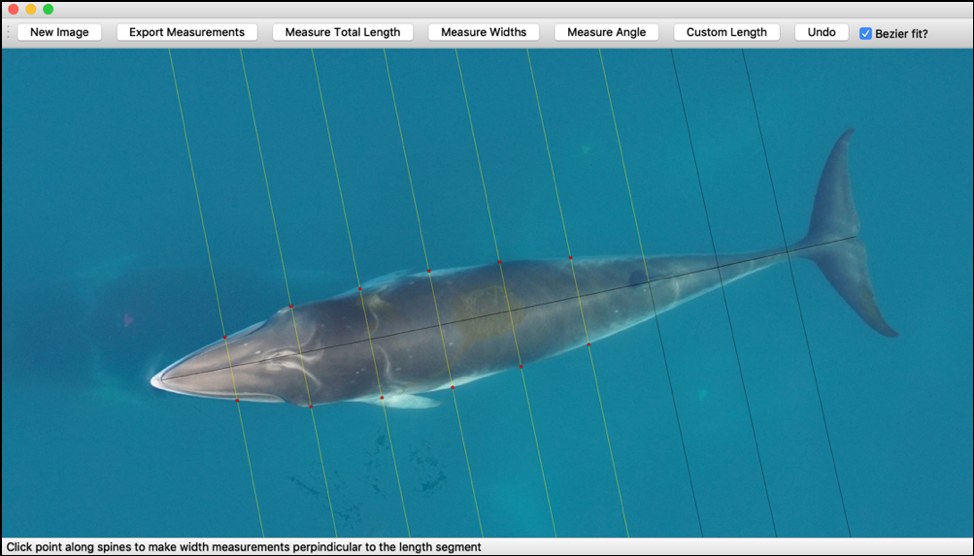

# Summary

Body size is recognized as one of the most important factors that determine animal function and performance in its environment [@SchmidtNielsen:1984] and well-sampled and accurate size measurements of wild animals can indicate population health [@Altmann:1993; @Hilderbrand:1999; @French:2011]. However, estimating the body size of large wild vertebrates, like many cetaceans (whales, dolphins, and porpoises) is particularly challenging, as their mobility and large size impedes in situ measurements or live capture [@Huang:2009; @Goldbogen:2015]. Historically, lethal sampling, either scientifically or opportunistically from commercial whaling, has provided measurements of large whales in the past [@Mackintosh:1929; @Lockyer:1985; @Ichii:1991; @Christiansen:2014], but these methods are often not permissible today, expensive, and/or are considered unethical and biased [@Baker:2000; @Clapham:2003; @Clapham:2018]. Alternatively, aerial photogrammetry has proven to be a reliable non-invasive method for obtaining measurements of many megavertebrates, such as cetaceans [@Perryman:2002; @Miller:2012], and the recent advancement of unoccupied aircraft systems (UAS, or drones) has enabled a more affordable, efficient, and accessible means of acquiring high-resolution aerial imagery for morphometric analysis [@Durban:2015; @Christiansen:2018; @Johnston:2019]. With increased opportunity to collect aerial imagery of inaccessible wildlife via UAS, an efficient and simple to use tool for accurate morphometric measurements is needed. 

``MorphoMetriX`` is a flexible photogrammetry graphical user interface (GUI) developed in PyQt5 for making efficient manual morphometric measurements of wild animals via aerial imagery. It was originally designed for the purpose of obtaining morphometric measurements of large whales imaged via UAS, but can be applied to other animals (e.g., pinnipeds, alligators, manatees) and used with nadir imagery collected via other platforms. 

``MorphoMetriX`` was inspired by the image processing program ImageJ [@Schneider:2012] and other UAS photogrammetry tools written in R [@Christiansen:2016] and MATLAB [@Dawson:2017; @Burnett:2018] that were developed specifically for measuring body condition of cetaceans. While ImageJ is an open source software with a powerful zoom function and the freedom and flexibility to measure any object of interest in an image, it lacks the ability to automatically section animals proportionally for perpendicular width measurements (i.e., body width measurements at 10% intervals along the total length of an animal), a key method used for comparative studies of body condition in cetaceans [@Miller:2012; @Christiansen:2016; @Dawson:2017; @Christiansen:2018].

Several software systems, written in MATLAB and R, have been developed to extract photogrammetric measures from aerial images of megavertebrates. However, some of these tools have slow workflows, are designed with only particular aircraft/sensor combinations and/or specific measurements in mind e.g., [@Dawson:2017; @Burnett:2018], have limited image zoom capabilities e.g., [@Christiansen:2016; @Dawson:2017; @Burnett:2018], and in some cases are not open source, requiring purchased or institutional licensing e.g., [@Dawson:2017; @Burnett:2018]. These existing tools written in R and MATLAB are relatively feature-rich, allowing the measurement of proportional body widths based on total length, as well as a set of additional pre-fixed morphometric measurement options, such as ‘width of eyes’, ‘rostrum to blowhole’, and ‘fluke width’.  However, these predetermined measurements are the only ones supported by the software system and can be altered and/or adapted only if the user has knowledge of the specific coding language, in these cases MATLAB or R.

MorphoMetriX is an open-source application that overcomes some of the limitations of these existing tools, combining the powerful zoom, accuracy, and measurement freedom of ImageJ, the accessibility of a GUI designed to measure body widths based on body length, and the speed of the PyQt5 codebase. It was designed as a simple to use and accurate program for robust morphometric analysis that does not require knowledge of any scripting language for customization. MorphoMetriX allows the user to input flight and sensor parameters, such as altitude, focal length, and pixel dimensions (calculated by dividing the sensor width of the camera by the image width in pixels), so that all measurements in pixels are automatically scaled to real world values (i.e., meters) (Fig. 1-3). The user imports an image of an animal and can create custom length measurements, such as “total length”, “fluke span”, “fluke chord width”, “pectoral fin width”, “scar”, etc (Fig. 2). The user can measure perpendicular widths based on a length measurement (the user can specify the number of width segments, Fig. 2 & 3). Additionally, the user has the option to “Measure Area” , where they can create custom area measurements such as “diatom patch” or “fluke area”, and to “Measure Angle” where the user can create a custom angle measurement, such as “Sweep Angle” (Fig. 2). Once completed, all measurements and their labels are exported into a .csv, along with an image of all the measurements that were made on the animal. 

``MorphoMetriX`` has already been used on several projects with a variety of cetacean species, including bottlenose dolphins, blue, humpback, fin, Antarctic minke, dwarf minke, pilot, and beaked whales. It is also ideal for training and teaching in the classroom for lessons and labs in photogrammetry and morphometrics.

# Figures
![Photogrammetric basics of how each UAS image is scaled to convert measurements in pixels to real world values (i.e., meters). Altitude is the distance between the camera lens and the animal/object of interest. Pixel dimensions is determined by dividing the sensor width of the camera (mm) by the image width (pixels). MorphoMetriX uses the altitude, focal length of camera (mm), and pixel dimensions to calculate the ground sampling distance (GSD), the distance each pixel represents on the ground. MorphoMetriX then multiplies the GSD by lengths measured in pixels by the user to scale to real world values (m).](../images/figure1.png)

![Image of Antarctic minke whale imported into MorphoMetriX. Measurements of total length and width (in 5% increments of total length in this case), as well as the area of a diatom patch (shaded polygon). Highlighted width lines guide the user to select a point along the width line, in this case the edge of the whale. A red dot marks the selected point and the next width line is highlighted. If the user accidentally selects a point adjacent to the highlighted line, the red dot will snap to the closest point on the highlighted line and record that point.](../images/figure2.png)

# Acknowledgements

We acknowledge Dr. David Johnston for project feedback and recommendations, Clara Bird for application development support, the students in the "Drones in Marine Biology, Ecology, and Conservation" Duke University summer course for beta testing, the Pivers Island Data Club for user feedback, as well as Michelle Pan and Nick Xu for UX suggestions. This work was supported by the Duke University Marine Laboratory.

# References
